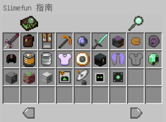

# 服务器材质包


服务器材质包并非强制的,但您使用服务器材质包可获得最佳游戏效果


服务器目前已使用原版增强材质包,包含粘液科技,匠魂系统等多种材质,丰富您的游戏体验. 

如何安装服务器材质包? 以下提供了三种方法

* 进入服务器后将弹出**\[是否同意服务器资源包\]**,选择**\[同意\]**即可 \(此种方法材质包将在每次进入服务器时加载\).
* 手动安装服务器材质包,在[**\[此处\]**](https://gitee.com/mcskycraft/skycraft/attach_files/716522/download/SkyCraft%E6%9C%8D%E5%8A%A1%E5%99%A8%E6%9D%90%E8%B4%A8v5.zip)下载服务器材质包,装进游戏即可\(优先度要高于你安装的其他材质\).
* 使用服务器官方客户端,无需任何操作默认安装\(客户端制作中\).

服务器材质包会经常更新,当前采用:v5版本

