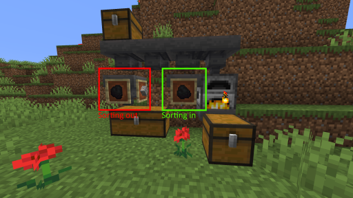

# 简易漏斗分类

想要摆脱使用红石志成的庞大分类系统？ 有了这个插件，你只需要把一个展示框贴在漏斗上。然后，漏斗只会从上面的容器中取出展示框里的指的物品。 你可以在一个漏斗上放许多展示框，来增加可以流过物品的数量。 当其中一个项展示框是空的时候，这个展示框会被忽略。 右键单击展示框来开或关掉这个展示框的过滤功能 如果有两个展示框放了同一个物品，插件只判定其中的一个物品 如果将物品重命名为"fuzzy"，插件将忽略物品的NBT等标签\[译者注：反之，插件支持过滤物品NBT\]。（可用铁砧重命名物品）

