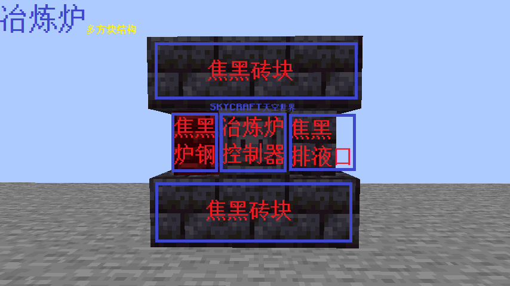
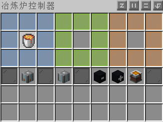

# 匠魂 / SlimeTinker


**空岛和单方块是两个匠魂插件 关于**[**单方块匠魂,点这**](https://doc.skycraft.cn/v/dfk/minetinker)


匠魂致力于在原版 Minecraft 中重现令人惊叹的 Tinker's Construct Mod（[链接](https://www.curseforge.com/minecraft/mc-mods/tinkers-construct)）。

## **匠魂插件的内容在粘液科技书中**

### 功能包括：

* 能够熔化所有 原版 和 粘液科技本体 的金属和合金.
* 将金属铸造成块、锭与工具零件（斧头、剑刃等）.
* 基于匠魂部件的任意组合制作匠魂工具
* 每个零件/金属组合都有特定的属性。属性范围从自动冶炼到飘浮，隐身到 3x3 采矿.
* 工具随您使用而升级，当它们升级时，它们会解锁新的插槽，并且可以从石头 &gt; 金 &gt; 铁 &gt; 钻石&gt;下届合金 依次升级.
* 修插槽可用于为工具添加特殊属性，从奖励掉落物到急迫、伤害等等。
* 工具不会损坏，它们只是不能使用了，但你可以使用与制作工具时相同的金属来修复它们
* 零件可以随意更换，保持工具级别/模组完好无损。
* 所有都适用于原版附魔。伤害、经验和耐久度修改都是可叠加的，并且可以很好地相互配合。

## 多方块结构

### 冶炼炉

#### 冶炼炉的使用

